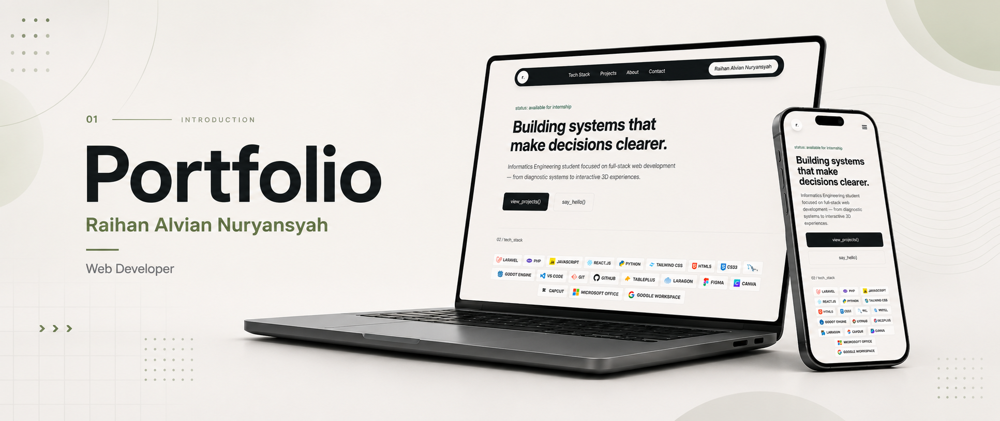

# Portfolio

Personal portfolio site — built to showcase the projects I've worked on, highlight the tools and technologies I use, and make it easy for recruiters, collaborators, or anyone curious to learn more about me and get in touch.

**[ralvihan.github.io/portfolio →](https://ralvihan.github.io/portfolio/)**

---

**Raihan Alvian Nuryansyah**

